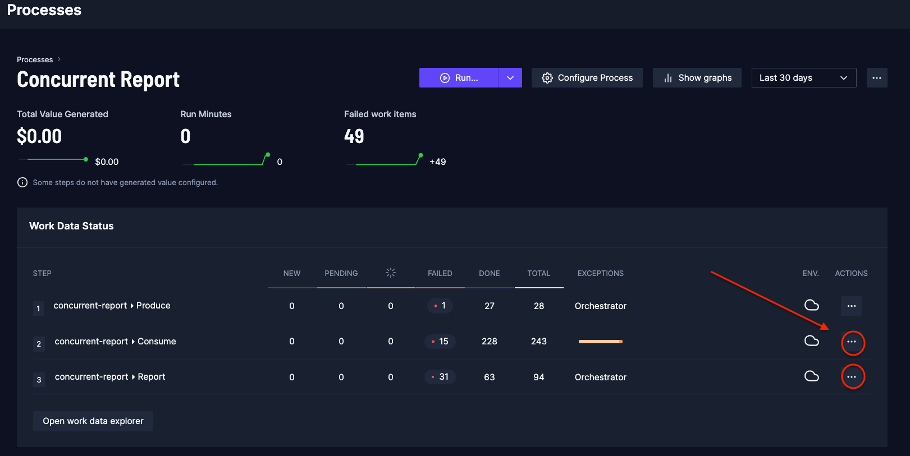

# Adding reporting step producer-consumer template

This repository provides workaround when 2nd step (`Consumer`) is ran **concurrently** and the target is to do the reporting in the 3rd step.

**note.** Control Room will be updated in the future which will make this kind of workaround as obsolete in the future.

Based on the [producer-consumer template](https://robocorp.com/portal/robot/robocorp/template-producer-consumer).

Additions/modifications to the template:

- add `report.robot` file which implements new 3rd step task `Report`
- add `workmanagement.resource` file containing variables and keywords required for gathering information from the Control Room and to handle reporting
- modify `producer.robot` to set Robocorp Vault key `REPORTED` to 0 in step 1 and will use static `orders.xlsx` as an input data
- modify `consumer.robot` to create output work items for step 3 (the `Report`)

## Short summary of logic in the `Report` task

The task will begin by checking work item states of step 2 (the `Consumer`).

If none of the work item states are either IN_PROGRESS or PENDING then reporting is possible (prerequisite for the reporting).

As the `Report` step could be started multiple times during process run due to the fact that step 2 is ran concurrently, we need to make sure that reporting is done only once.

If Robocorp Vault key `REPORTED` is still 0 and all step 2 runs are completed (the prerequisite) then Robocorp Vault key `REPORTED` is set to value 1 and reporting action can
be completed (this will mean that any following step 3 run will not start reporting again).

## Configuration

As work item information is checked with [RPA.Robocorp.Process](https://robocorp.com/docs/libraries/rpa-framework/rpa-robocorp-process) library (meaning Robocorp Process API), we need 2 variables set into `workmanagement.resource` file.

The `${ACTIVITY_ID_STEP_2}` variable which is the identifier for step 2 of the process.
The `${ACTIVITY_ID_STEP_3}` variable which is the identifier for step 3 of the process.

### How to get activity ID for the step ?

1. In the Control Room Workspace open `Processes` view
2. Open the process you are working on
3. Click `...` icon (show in the below image) to open `Show Step details page` link
4. The activityID for the step is the last ID in the browser URL https://cloud.robocorp.com/xxxx/xxxx/processes/PROCESS_ID/steps/ACTIVITY_ID
5. Copy the ID to the corresponding value for the variable in the `workmanagement.resource` file

